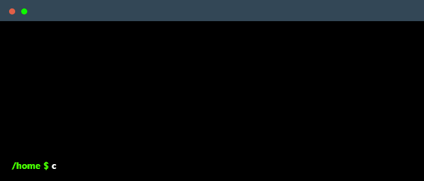

# 💫 About Me:

<table>
  <tr>
    <td## About Me

Breaking into cybersecurity one CTF at a time. 

I work on penetration testing, threat detection, and cloud security projects. Built intrusion detection systems, automated AWS monitoring, and spent way too much time with Burp Suite and DVWA.

Won a couple CTFs, got some certs (ISC2 CC, working on BTL1), and genuinely enjoy finding vulnerabilities before they become problems.

Always learning. Always caffeinated. If there's a bug, there's a fix—just need to find it.
    <td>
      
    </td>
  </tr>
</table>

    

## 🌐 Socials:
 | 

# 📊 GitHub Stats:
|  |  |
|:--------------------------------------------------------------------------------------------------------------------------:|:-----------------------------------------------------------------------------------------------------:|

